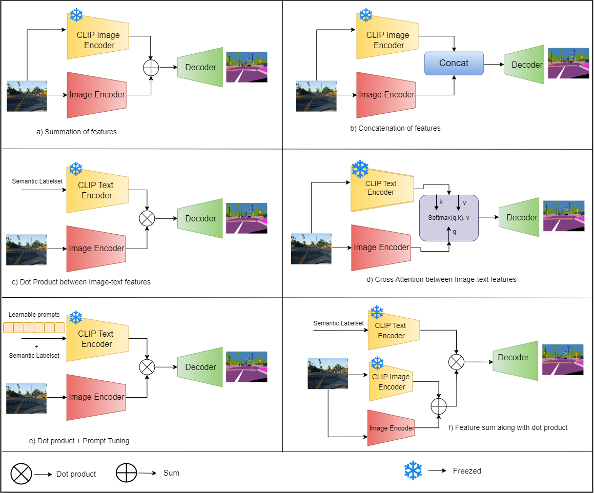
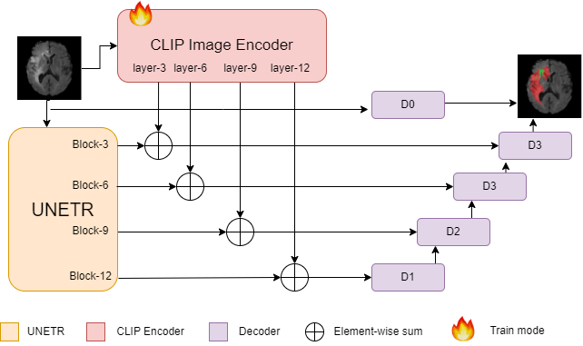

# Improving Dense Prediction Tasks using Vision-Language Models

The project is based on the applications of CLIP in Semantic Segmentation Problems. We take into consideration two problem settings: Natural Image Segmentation and Medical Imaging Segmentation.

#

## CLIP based Semantic Segmentation on NYU-V2 Dataset

We integrated CLIP with [MultiMAE](https://github.com/EPFL-VILAB/MultiMAE) under various settings and analysed the performance. We utilized both CLIP Image and Text Encoders under various experimental settings. We further validated that CLIP based features are not always useful in the presence of strong pretrained Encoders.

#

## CLIP based Medical Image Segmentation on BTCV Dataset

We integrated CLIP Image with [UNETR](https://github.com/Project-MONAI/research-contributions/tree/main/UNETR/BTCV) and [SwinUNETR](https://github.com/Project-MONAI/research-contributions/tree/main/SwinUNETR/BTCV). To induce domain knowledge in CLIP, we used the CLIP visual encoder in finetuning mode. We combined the output from 3rd, 6th, 9th and 12th block of CLIP visual encoder with the corresponding blocks of UNETR and SwinUNETR.

